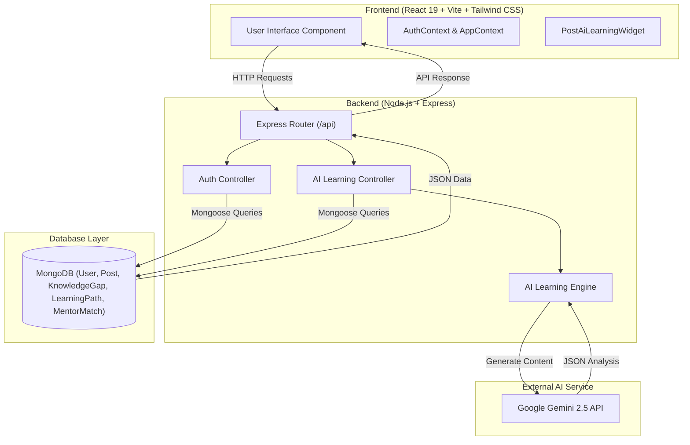

# EduHive

> A Collaborative Peer-to-Peer Educational Platform for Knowledge Sharing, AI-Driven Adaptive Learning, and Academic Discussions.

### Team Details
* **Project Name**: EduHive
* **Team Members**:
  * Amalanathan R
  * Adithyan S K
  * Ashwin I S
  * Barathi Caestrou
  * Asbanesh Joel D
  * Adithya Pai A
* **Repository**: [EduHive Repository](https://github.com/maximN27/Eduhive)

---

## Problem Statement and Solution

### Problem Statement
Students and self-learners often struggle to find structured, noise-free platforms to discuss subject-specific queries, share code snippets, store reference study material, and track their personal learning progress. Existing platforms lack automated feedback on conceptual weak spots, tailored adaptive study paths, and verified peer mentorship.

### Solution
**EduHive** provides a centralized, subject-focused educational hub where learners can post questions, share code snippets, engage in peer discussions, upvote valuable contributions, and save study resources. Integrated with an **AI-Powered Personalized Learning Path & Knowledge Gap Engine** (powered by Google Gemini 2.5 AI), EduHive automatically analyzes post content and code snippets to detect concept gaps, generate customized multi-step study roadmaps, and connect students with verified Professors, Industry Professionals, and top Scholars.

---

## Key Features

- 🧠 **AI Knowledge Gap Detection**: Real-time concept analysis powered by Google Gemini API (`gemini-flash-latest`), identifying weak spots (e.g. Recursion, Call Stack, Memory Leaks) with confidence meters and severity indicators.
- 🗺️ **Adaptive AI Learning Paths**: Automatically generated 3-step study roadmaps complete with estimated study times, exercise prompts, documentation links, and interactive progress tracking.
- 🤝 **Peer Mentor Matching**: AI compatibility pairing connecting students with verified Professors, Industry Professionals, or top-reputation Scholars.
- 🔐 **Role-Based Authentication**: Full-page responsive login & role selection modal supporting Student, Professor, and Professional accounts.
- 📚 **Subject & Tag Categorization**: Filter discussions by academic subjects and specific skill tags.
- 🔍 **Interactive Search**: Full-text search across titles, post content, and tags.
- 💻 **Code Snippet Integration**: Dedicated support for sharing and formatting code snippets within posts.
- 👍 **Upvoting & Bookmarking**: Community moderation enabling upvoting of helpful posts and saving key resources.
- 💬 **Nested Discussions**: Author-attributed comment threads on posts.
- 🛡️ **JWT Security**: Password hashing with `bcryptjs`, session verification via JSON Web Tokens, and persistent session restoration.

---

## Complete Tech Stack

### Frontend
- **Framework**: React 19 + Vite 6
- **Styling**: Tailwind CSS v4
- **Language**: JavaScript (ES6+)

### Backend
- **Runtime**: Node.js
- **Web Framework**: Express.js
- **AI Integration**: `@google/genai` (Google Gemini 2.5 AI)
- **Authentication**: `jsonwebtoken` (JWT), `bcryptjs`
- **CORS & Logging**: `cors`, `morgan`

### Database
- **Database**: MongoDB / MongoDB Atlas
- **ODM**: Mongoose 8

---

## System Architecture Diagram



---

## Folder Structure

```text
EduHive/
├── frontend/                     # React 19 + Vite + Tailwind CSS App
│   ├── public/
│   ├── src/
│   │   ├── components/           # UI Components (Navbar, PostAiLearningWidget, RoleSelectionModal, EduHiveLogo, AuthIcons)
│   │   ├── pages/                # Main Application Views (Home, PostPage, ProfilePage, Login, Signup)
│   │   ├── services/             # API Wrappers (authService, postService, aiLearningService, api.js)
│   │   ├── context/              # Context Providers (AuthContext, AppContext)
│   │   ├── App.jsx               # Application Auth Gate & Root
│   │   ├── main.jsx              # React DOM entry point
│   │   └── index.css             # Design Tokens & Tailwind Directives
│   ├── vite.config.js            # Vite configuration
│   └── package.json
├── backend/                      # Node.js + Express + Mongoose Backend
│   ├── src/
│   │   ├── config/
│   │   │   └── db.js             # MongoDB connection utility
│   │   ├── controllers/          # Controllers (authController, aiLearningController, postController)
│   │   ├── middleware/           # Auth and error handling middlewares
│   │   ├── models/               # Mongoose Schemas (User, Post, KnowledgeGap, LearningPath, MentorMatch)
│   │   ├── routes/               # API Routes (authRoutes, aiLearningRoutes, postRoutes)
│   │   ├── services/             # AI Engine (aiLearningEngine.js, geminiService.js)
│   │   └── server.js             # Express application server
│   └── package.json
└── README.md                     # Project documentation
```

---

## Installation and Starting Guide

### Prerequisites
- Node.js (v18.0.0 or higher)
- npm (v9.0.0 or higher)
- MongoDB URI (local instance or MongoDB Atlas)
- Google Gemini API Key

### 1. Clone Repository
```bash
git clone https://github.com/maximN27/Eduhive.git
cd Eduhive
```

### 2. Backend Setup & Start
```bash
cd backend
npm install

# Create environment configuration file (.env)
```
Add your credentials to `backend/.env`:
```env
PORT=5000
MONGODB_URI=mongodb://127.0.0.1:27017/eduhive
JWT_SECRET=your_super_secret_jwt_key
GEMINI_API_KEY=your_google_gemini_api_key
```
Start the backend development server:
```bash
npm run dev
```
*(Server will start on `http://localhost:5000`)*

### 3. Frontend Setup & Start
Open a **new terminal window**:
```bash
cd Eduhive/frontend
npm install
```
Start the frontend development server:
```bash
npm run dev
```
*(Application will open on `http://localhost:3000`)*

---

## API Documentation Summary

### Authentication Endpoints (`/api/auth`)
| Method | Endpoint | Description |
| :--- | :--- | :--- |
| `POST` | `/api/auth/register` | Register user (`student`, `teacher`, `professional`) |
| `POST` | `/api/auth/login` | Login user with email & password |
| `GET` | `/api/auth/me` | Fetch authenticated user profile & restore session |
| `POST` | `/api/auth/logout` | Logout user session |

### AI Learning Endpoints (`/api/ai-learning`)
| Method | Endpoint | Description |
| :--- | :--- | :--- |
| `POST` | `/api/ai-learning/analyze-post` | Analyze post content for conceptual knowledge gaps |
| `POST` | `/api/ai-learning/generate-path` | Generate adaptive multi-step study path for concept |
| `PATCH` | `/api/ai-learning/paths/:id/modules/:step` | Update module step completion progress |
| `POST` | `/api/ai-learning/mentor-matches` | Recommend peer mentors (Professors, Professionals, Scholars) |
| `POST` | `/api/ai-learning/mentors/connect` | Send mentorship connection request notification |

---

## AI/ML Integration Details

EduHive leverages Google Gemini API (`gemini-flash-latest`) via the `@google/genai` SDK:
1. **Gap Analysis Prompting**: Structured JSON prompts inspect post titles, code snippets, and comments to extract specific concept weak spots and confidence scores.
2. **Adaptive Curriculum Sequencing**: Generates milestone modules with estimated study durations, exercise descriptions, and external doc links.
3. **Mentor Match Scoring**: Computes compatibility fit based on subject mastery, streak XP, and account verification status.

---

## Security Measures

- **Password Security**: Passwords hashed using `bcryptjs` with 10 salt rounds.
- **JWT Authorization**: Signed JSON Web Tokens with 30-day expiration.
- **Environment Isolation**: Sensitive keys (`GEMINI_API_KEY`, `MONGODB_URI`, `JWT_SECRET`) stored strictly in `.env`.
- **Input Validation**: Strict role validation accepting only `student`, `teacher`, or `professional`.

---

## License & References

- [React Documentation](https://react.dev/)
- [Vite Guide](https://vite.dev/guide/)
- [Tailwind CSS Documentation](https://tailwindcss.com/docs)
- [Express.js API Reference](https://expressjs.com/)
- [Google Gemini API Docs](https://ai.google.dev/gemini-api/docs)
