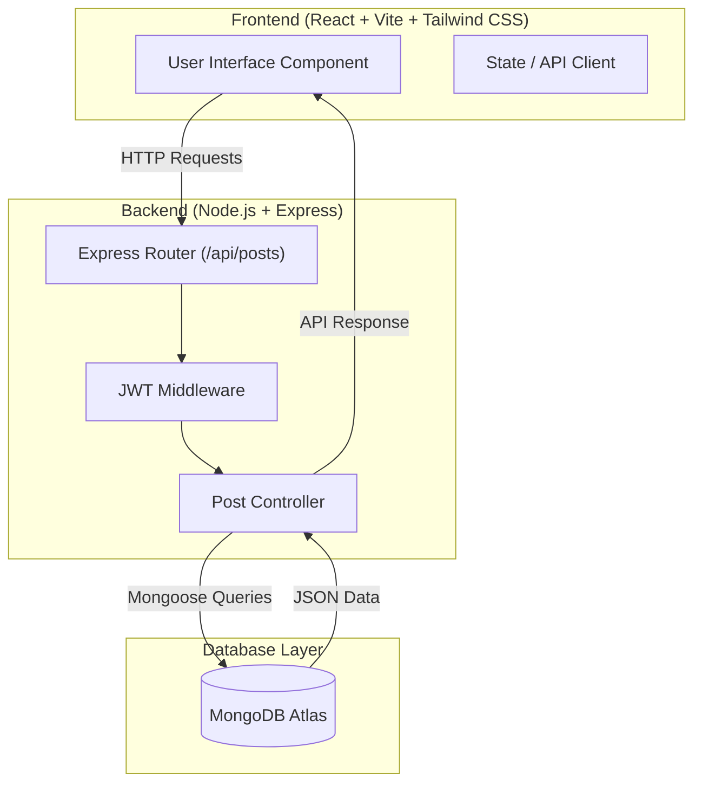

# EduHive

> A Collaborative Peer-to-Peer Educational Platform for Knowledge Sharing and Academic Discussions.

### Team Details
* **Project Name**: EduHive
* **Team Members**:
  * Amalanathan R
  * Adithyan S K
  * Ashwin I S
  * Barathi Caestrou
  * Asbanesh Joel D
  * Adithya Pai A
* **Repository**: [EduHive Repository](https://github.com/maximN27/Eduhive)

---

## Problem Statement and Solution

### Problem Statement
Students and self-learners often struggle to find structured, noise-free platforms to discuss subject-specific queries, share code snippets, and store reference study material. Existing general-purpose social networks lack academic categorization, tag filtering, code highlight capabilities, and peer-reviewed answer threads.

### Solution
**EduHive** provides a centralized, subject-focused educational hub where learners can post questions, share code snippets, engage in peer discussions through comments, upvote valuable contributions, and save posts for offline review. By organizing content around subjects and tags, EduHive fosters focused academic collaboration.

---

## Features

- 📚 **Subject & Tag Categorization**: Filter discussions by academic subjects and specific skill tags.
- 🔍 **Interactive Search**: Full-text search across titles, post content, and tags.
- 💻 **Code Snippet Integration**: Dedicated support for sharing and formatting code snippets within posts.
- 👍 **Upvoting System**: Community moderation enabling upvoting of helpful posts.
- 🔖 **Post Bookmarking**: Ability to save key posts for quick retrieval.
- 💬 **Nested Discussions**: Author-attributed comment threads on posts.
- 🛡️ **JWT Authentication & Authorization**: Secure user registration, password hashing with `bcrypt`, and session verification via JSON Web Tokens.

---

## Complete Tech Stack

### Frontend
- **Framework**: React 19 + Vite 6
- **Styling**: Tailwind CSS v4
- **Language**: JavaScript (ES6+)

### Backend
- **Runtime**: Node.js
- **Web Framework**: Express.js
- **Authentication**: `jsonwebtoken` (JWT), `bcryptjs`
- **CORS**: `cors`

### Database
- **Database**: MongoDB Atlas
- **ODM**: Mongoose 8

---

## System Architecture Diagram



---

## Detailed Workflow

1. **User Request**: The user interacts with the React frontend to browse, create, upvote, or save educational posts.
2. **API Routing**: Requests are sent to `http://localhost:5000/api/posts` endpoints handled by Express router middleware.
3. **Business Logic Execution**: The `postController` handles validation, query filtering (by subject, tag, or search term), and upvote/save state transitions.
4. **Data Persistence**: Mongoose executes queries against MongoDB Atlas collections (`Post` and nested `commentSchema`).
5. **Response Rendering**: Formatted JSON responses are returned to the client and rendered dynamically via React state updates.

---

## Folder Structure

```text
EduHive/
├── frontend/                     # React 19 + Vite + Tailwind CSS App
│   ├── public/
│   ├── src/
│   │   ├── components/           # Reusable UI components
│   │   ├── pages/                # Main application views
│   │   ├── services/             # API request wrappers
│   │   ├── context/              # React state context
│   │   ├── App.jsx               # Application root
│   │   ├── main.jsx              # React DOM entry point
│   │   └── index.css             # Tailwind CSS import directives
│   ├── index.html
│   ├── vite.config.js            # Vite configuration
│   ├── package.json
│   ├── .env.example              # Frontend environment template
│   └── .gitignore
├── backend/                      # Node.js + Express + Mongoose Backend
│   ├── src/
│   │   ├── config/
│   │   │   └── db.js             # MongoDB connection utility
│   │   ├── controllers/
│   │   │   └── postController.js # Post CRUD and interaction handlers
│   │   ├── middleware/           # Auth and error handling middlewares
│   │   ├── models/
│   │   │   └── Post.js           # Mongoose Post & Comment schemas
│   │   ├── routes/
│   │   │   └── postRoutes.js     # API endpoints mapping
│   │   ├── utils/                # Helper functions
│   │   └── server.js             # Express application server
│   ├── package.json
│   ├── .env.example              # Backend environment template
│   └── .gitignore
├── .gitignore                    # Root gitignore
└── README.md                     # Project documentation
```

---

## Installation and Usage Guide

### Prerequisites
- Node.js (v18.0.0 or higher)
- npm (v9.0.0 or higher)
- MongoDB Atlas database connection URI

### 1. Repository Setup
```bash
git clone https://github.com/maximN27/Eduhive.git
cd Eduhive
```

### 2. Backend Setup
```bash
cd backend
npm install

# Create environment configuration
cp .env.example .env
```
Edit `backend/.env` with your credentials:
```env
PORT=5000
MONGODB_URI=mongodb+srv://<username>:<password>@cluster.mongodb.net/eduhive?retryWrites=true&w=majority
JWT_SECRET=your_super_secret_jwt_key
```
Start the backend development server:
```bash
npm run dev
```

### 3. Frontend Setup
Open a new terminal window:
```bash
cd frontend
npm install

# Create environment configuration
cp .env.example .env
```
Edit `frontend/.env`:
```env
VITE_API_URL=http://localhost:5000/api
```
Start the frontend development server:
```bash
npm run dev
```

---

## API & Database Documentation

### API Endpoints (`/api/posts`)

| Method | Endpoint | Description | Query / Body Params |
| :--- | :--- | :--- | :--- |
| `GET` | `/api/posts` | Fetch all posts with optional filtering | `?subject=ID`, `?tag=NAME`, `?search=QUERY` |
| `POST` | `/api/posts` | Create a new post | Body: `{ author, subjectId, subjectName, title, content, tags, codeSnippet }` |
| `PUT` | `/api/posts/:id/upvote` | Increment post upvote count | URL parameter: `id` |
| `PUT` | `/api/posts/:id/save` | Toggle saved status for a post | URL parameter: `id` |
| `POST` | `/api/posts/:id/comments` | Add a comment to a post | Body: `{ author, avatar, content }` |

### Database Schemas (Mongoose)

#### Post Schema
```js
{
  author: {
    name: String,
    handle: String,
    avatar: String,
    role: String // Default: 'Scholar'
  },
  subjectId: String,
  subjectName: String,
  tags: [String],
  title: String,
  content: String,
  codeSnippet: String,
  upvotes: Number,
  saved: Boolean,
  comments: [commentSchema],
  timestamps: true
}
```

---

## AI/ML Workflow
*N/A (Skipped - Not applicable for current core Web application build).*

---

## Hardware Components & Circuit Diagrams
*N/A (Skipped - Software project).*

---

## Security Measures

- **Password Hashing**: Passwords stored via `bcryptjs` with salt rounds.
- **Stateless Authentication**: JSON Web Tokens (JWT) for secure API request authentication.
- **Environment Isolation**: Sensitive database URIs and secret keys stored strictly in `.env` files (excluded via `.gitignore`).
- **CORS Configuration**: Restricts unauthorized cross-origin requests.

---

## Testing and Performance

- **Backend Health Check**: Server exposes `/health` route returning application connectivity metrics.
- **Fast Module Bundling**: Frontend powered by Vite HMR (Hot Module Replacement) for instant sub-second reloads.
- **Database Indexing**: Text search queries performed using optimized MongoDB regex and index matching.

---

## Challenges Faced and Future Scope

### Challenges Faced
- Managing seamless search filtering across multiple fields (titles, tags, and content) efficiently.
- Ensuring clean sync between nested Mongoose schemas (comments array inside Post model) and atomic updates.

### Future Scope
- Real-time notifications using Socket.io when users reply to posted questions.
- Peer code execution environment (Sandbox/Judge0 integration).
- Direct peer-to-peer chat and study rooms.

---

## Demo Screenshots / Video Links
*Demo screenshots and walk-through videos will be added upon deployment.*

---

## References

- [React Documentation](https://react.dev/)
- [Vite Guide](https://vite.dev/guide/)
- [Tailwind CSS Documentation](https://tailwindcss.com/docs)
- [Express.js API Reference](https://expressjs.com/)
- [Mongoose Docs](https://mongoosejs.com/docs/)
